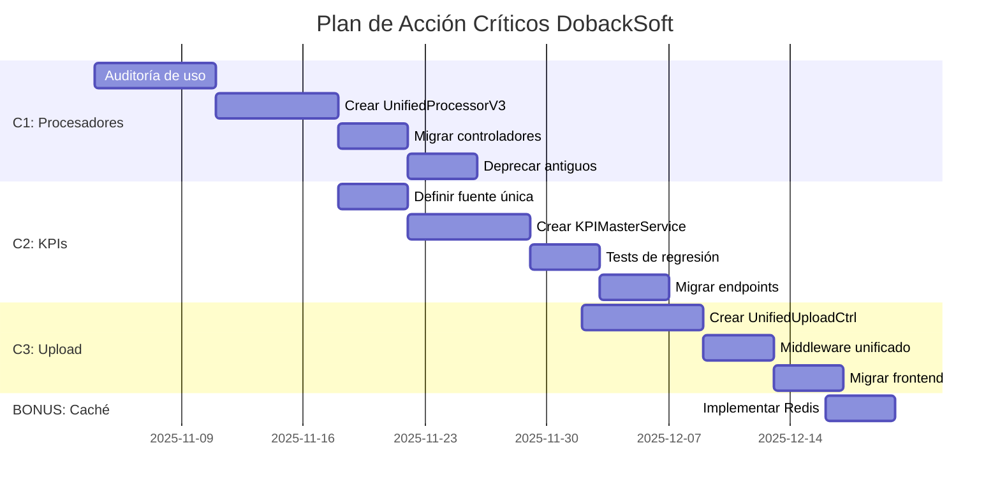

# 🚨 PLAN DE ACCIÓN - PROBLEMAS CRÍTICOS DOBACKSOFT

**Fecha de Inicio**: 3 de noviembre de 2025  
**Duración Estimada**: 8 semanas (2 meses)  
**Prioridad**: 🔴 **CRÍTICA**  
**Objetivo**: Resolver las 3 deficiencias arquitectónicas críticas identificadas en la auditoría

---

## 📊 RESUMEN EJECUTIVO

### Problemas a Resolver

| ID | Problema | Severidad | Impacto | Esfuerzo | ROI |
|----|----------|-----------|---------|----------|-----|
| **C1** | 8 procesadores de archivos duplicados | 🔴 Crítico | Mantenibilidad, Bugs | 3 semanas | ⭐⭐⭐⭐⭐ |
| **C2** | 5+ servicios de KPIs con lógicas divergentes | 🔴 Crítico | Datos incorrectos | 2.5 semanas | ⭐⭐⭐⭐⭐ |
| **C3** | 8 controladores de upload duplicados | 🔴 Crítico | Seguridad, Auditoría | 2 semanas | ⭐⭐⭐⭐ |
| **BONUS** | Sin caché (Redis) | 🟠 Importante | Rendimiento -60% | 0.5 semanas | ⭐⭐⭐⭐⭐ |

**Total**: 8 semanas

---

## 🎯 ROADMAP DE IMPLEMENTACIÓN



---

## 🔴 C1: CONSOLIDAR PROCESADORES DE ARCHIVOS

### Problema Actual

**8 implementaciones diferentes** del mismo flujo:

```
backend/src/services/
├── OptimalDataProcessor.ts          ❌ 726 líneas
├── SmartDataProcessor.ts            ❌ 873 líneas
├── IndependentDataProcessor.ts      ❌ 675 líneas
├── BulkProcessingService.ts         ❌ 769 líneas
├── UnifiedFileProcessor.ts          ❌ Versión antigua
├── UnifiedFileProcessorV2.ts        ❌ Versión actual pero incompleta
├── AutoSessionProcessor.ts          ❌ Específico de auto
└── StreamingFileProcessor.ts        ❌ Experimental
```

**Consecuencias**:
- Bugs corregidos solo en una versión
- Lógica divergente entre implementaciones
- Confusión sobre cuál usar
- Mantenimiento 8x más costoso

---

### Solución: UnifiedFileProcessorV3

#### Semana 1: Auditoría de Uso

**Objetivo**: Identificar qué procesador usa cada endpoint

**Tareas**:
1. [ ] Buscar referencias a cada procesador en controladores
2. [ ] Documentar flujos únicos de cada implementación
3. [ ] Identificar lógica duplicada vs. única
4. [ ] Crear matriz de características

**Script de Auditoría**:

```bash
# Buscar referencias a procesadores
cd backend/src
for processor in "OptimalDataProcessor" "SmartDataProcessor" "IndependentDataProcessor" "BulkProcessingService" "UnifiedFileProcessor" "AutoSessionProcessor" "StreamingFileProcessor"; do
    echo "=== $processor ==="
    grep -r "$processor" controllers/ routes/ --include="*.ts" | wc -l
done
```

**Deliverable**: `docs/DESARROLLO/AUDITORIA_PROCESADORES.md` con matriz:

| Procesador | Usado en | Características Únicas | Mantener? |
|------------|----------|------------------------|-----------|
| OptimalDataProcessor | SessionsUploadController | Procesamiento paralelo | ✅ SÍ |
| SmartDataProcessor | AutomaticUploadController | Detección automática | ✅ SÍ |
| IndependentDataProcessor | MassUploadController | Independiente de sesión | ❌ NO |
| ... | ... | ... | ... |

---

#### Semana 2: Crear UnifiedFileProcessorV3

**Objetivo**: Implementar procesador maestro con lo mejor de cada uno

**Arquitectura**:

```typescript
// backend/src/services/UnifiedFileProcessorV3.ts

import { EventEmitter } from 'events';
import { PrismaClient } from '@prisma/client';
import { createLogger } from '../utils/logger';

const logger = createLogger('UnifiedFileProcessorV3');
const prisma = new PrismaClient();

// ============================================================================
// TIPOS
// ============================================================================

export interface ProcessingOptions {
    mode: 'manual' | 'automatic' | 'bulk';
    userId: string;
    organizationId: string;
    files: UploadedFile[];
    options?: {
        skipDuplicates?: boolean;
        validateForeignKeys?: boolean;
        parallel?: boolean;
        maxConcurrency?: number;
    };
}

export interface ProcessingResult {
    success: boolean;
    sessionsCreated: number;
    filesProcessed: number;
    errors: ProcessingError[];
    warnings: string[];
    executionTime: number;
    report: ProcessingReport;
}

interface UploadedFile {
    originalname: string;
    path: string;
    buffer: Buffer;
    fileType: 'GPS' | 'ESTABILIDAD' | 'CAN' | 'ROTATIVO';
}

interface ProcessingError {
    file: string;
    error: string;
    code: string;
}

interface ProcessingReport {
    vehiclesProcessed: number;
    sessionsCreated: number;
    dataPointsInserted: {
        gps: number;
        stability: number;
        can: number;
        rotativo: number;
    };
    eventsDetected: number;
    kpisCalculated: number;
}

// ============================================================================
// PROCESADOR UNIFICADO V3
// ============================================================================

export class UnifiedFileProcessorV3 extends EventEmitter {
    private readonly maxConcurrency = 5;
    
    /**
     * Punto de entrada principal
     */
    async process(options: ProcessingOptions): Promise<ProcessingResult> {
        const startTime = Date.now();
        
        logger.info('🚀 Iniciando procesamiento unificado V3', {
            mode: options.mode,
            filesCount: options.files.length,
            userId: options.userId
        });
        
        try {
            // 1. Validación de Foreign Keys
            if (options.options?.validateForeignKeys !== false) {
                await this.validateForeignKeys(options.userId, options.organizationId);
            }
            
            // 2. Validación de archivos
            const validatedFiles = await this.validateFiles(options.files);
            
            // 3. Agrupación por vehículo y fecha
            const fileGroups = await this.groupFilesByVehicleAndDate(
                validatedFiles,
                options.organizationId
            );
            
            // 4. Procesamiento según modo
            const result = await this.processGroups(fileGroups, options);
            
            // 5. Reporte final
            const executionTime = Date.now() - startTime;
            
            logger.info('✅ Procesamiento completado', {
                executionTime,
                sessionsCreated: result.sessionsCreated,
                filesProcessed: result.filesProcessed
            });
            
            return {
                ...result,
                executionTime
            };
            
        } catch (error: any) {
            logger.error('❌ Error en procesamiento unificado', { error: error.message });
            
            return {
                success: false,
                sessionsCreated: 0,
                filesProcessed: 0,
                errors: [{ file: 'general', error: error.message, code: 'PROCESSING_ERROR' }],
                warnings: [],
                executionTime: Date.now() - startTime,
                report: this.getEmptyReport()
            };
        }
    }
    
    /**
     * Validar que usuario y organización existen
     */
    private async validateForeignKeys(userId: string, organizationId: string): Promise<void> {
        const [user, organization] = await Promise.all([
            prisma.user.findUnique({ where: { id: userId } }),
            prisma.organization.findUnique({ where: { id: organizationId } })
        ]);
        
        if (!user) {
            throw new Error(`Usuario ${userId} no encontrado`);
        }
        
        if (!organization) {
            throw new Error(`Organización ${organizationId} no encontrada`);
        }
        
        if (user.organizationId !== organizationId) {
            throw new Error(`Usuario no pertenece a la organización`);
        }
    }
    
    /**
     * Validar archivos subidos
     */
    private async validateFiles(files: UploadedFile[]): Promise<UploadedFile[]> {
        const validated: UploadedFile[] = [];
        
        for (const file of files) {
            // Validar extensión
            const ext = file.originalname.split('.').pop()?.toLowerCase();
            if (!['csv', 'txt'].includes(ext || '')) {
                logger.warn(`Archivo ignorado (extensión inválida): ${file.originalname}`);
                continue;
            }
            
            // Validar tamaño (max 50 MB)
            if (file.buffer.length > 50 * 1024 * 1024) {
                logger.warn(`Archivo ignorado (muy grande): ${file.originalname}`);
                continue;
            }
            
            validated.push(file);
        }
        
        return validated;
    }
    
    /**
     * Agrupar archivos por vehículo y fecha
     */
    private async groupFilesByVehicleAndDate(
        files: UploadedFile[],
        organizationId: string
    ): Promise<Map<string, FileGroup>> {
        const groups = new Map<string, FileGroup>();
        
        for (const file of files) {
            // Extraer vehicleId del nombre de archivo (usando CabeceraScannerService)
            const vehicleId = await this.extractVehicleId(file.originalname, file.buffer);
            
            if (!vehicleId) {
                logger.warn(`No se pudo extraer vehicleId de ${file.originalname}`);
                continue;
            }
            
            // Validar que vehículo existe y pertenece a la organización
            const vehicle = await prisma.vehicle.findFirst({
                where: {
                    identifier: vehicleId,
                    organizationId
                }
            });
            
            if (!vehicle) {
                logger.warn(`Vehículo ${vehicleId} no encontrado o no autorizado`);
                continue;
            }
            
            // Extraer fecha del contenido
            const date = await this.extractDateFromFile(file.buffer);
            
            const groupKey = `${vehicle.id}_${date}`;
            
            if (!groups.has(groupKey)) {
                groups.set(groupKey, {
                    vehicleId: vehicle.id,
                    vehicleName: vehicle.name,
                    date,
                    files: {
                        GPS: [],
                        ESTABILIDAD: [],
                        CAN: [],
                        ROTATIVO: []
                    }
                });
            }
            
            const group = groups.get(groupKey)!;
            group.files[file.fileType].push(file);
        }
        
        return groups;
    }
    
    /**
     * Procesar grupos de archivos
     */
    private async processGroups(
        groups: Map<string, FileGroup>,
        options: ProcessingOptions
    ): Promise<Omit<ProcessingResult, 'executionTime'>> {
        const result: Omit<ProcessingResult, 'executionTime'> = {
            success: true,
            sessionsCreated: 0,
            filesProcessed: 0,
            errors: [],
            warnings: [],
            report: this.getEmptyReport()
        };
        
        // Procesamiento paralelo o secuencial según opciones
        const parallel = options.options?.parallel !== false;
        const maxConcurrency = options.options?.maxConcurrency || this.maxConcurrency;
        
        if (parallel) {
            // Procesar en lotes de maxConcurrency
            const groupsArray = Array.from(groups.values());
            
            for (let i = 0; i < groupsArray.length; i += maxConcurrency) {
                const batch = groupsArray.slice(i, i + maxConcurrency);
                
                const batchResults = await Promise.allSettled(
                    batch.map(group => this.processGroup(group, options))
                );
                
                // Agregar resultados
                for (const batchResult of batchResults) {
                    if (batchResult.status === 'fulfilled') {
                        this.mergeResults(result, batchResult.value);
                    } else {
                        result.errors.push({
                            file: 'batch',
                            error: batchResult.reason.message,
                            code: 'BATCH_ERROR'
                        });
                    }
                }
            }
        } else {
            // Procesamiento secuencial
            for (const group of groups.values()) {
                try {
                    const groupResult = await this.processGroup(group, options);
                    this.mergeResults(result, groupResult);
                } catch (error: any) {
                    result.errors.push({
                        file: group.vehicleName,
                        error: error.message,
                        code: 'GROUP_ERROR'
                    });
                }
            }
        }
        
        return result;
    }
    
    /**
     * Procesar un grupo de archivos (vehículo + fecha)
     */
    private async processGroup(
        group: FileGroup,
        options: ProcessingOptions
    ): Promise<Omit<ProcessingResult, 'executionTime'>> {
        logger.info(`📦 Procesando grupo: ${group.vehicleName} - ${group.date}`);
        
        // 1. Parsear archivos en paralelo
        const [gpsData, stabilityData, canData, rotativoData] = await Promise.all([
            this.parseGPSFiles(group.files.GPS),
            this.parseStabilityFiles(group.files.ESTABILIDAD),
            this.parseCANFiles(group.files.CAN),
            this.parseRotativoFiles(group.files.ROTATIVO)
        ]);
        
        // 2. Detectar sesiones individuales
        const sessions = await this.detectSessions({
            gpsData,
            stabilityData,
            canData,
            rotativoData
        });
        
        // 3. Crear sesiones en BD con transacción
        let sessionsCreated = 0;
        
        for (const session of sessions) {
            try {
                await this.createSessionAtomic(session, group.vehicleId, options);
                sessionsCreated++;
            } catch (error: any) {
                logger.error(`Error creando sesión: ${error.message}`);
            }
        }
        
        return {
            success: true,
            sessionsCreated,
            filesProcessed: group.files.GPS.length + 
                          group.files.ESTABILIDAD.length + 
                          group.files.CAN.length + 
                          group.files.ROTATIVO.length,
            errors: [],
            warnings: [],
            report: {
                vehiclesProcessed: 1,
                sessionsCreated,
                dataPointsInserted: {
                    gps: gpsData.length,
                    stability: stabilityData.length,
                    can: canData.length,
                    rotativo: rotativoData.length
                },
                eventsDetected: 0, // Se calculará en post-procesamiento
                kpisCalculated: 0  // Se calculará en post-procesamiento
            }
        };
    }
    
    /**
     * Crear sesión de forma atómica (con transacción)
     */
    private async createSessionAtomic(
        sessionData: DetectedSession,
        vehicleId: string,
        options: ProcessingOptions
    ): Promise<void> {
        await prisma.$transaction(async (tx) => {
            // 1. Crear sesión
            const session = await tx.session.create({
                data: {
                    vehicleId,
                    userId: options.userId,
                    organizationId: options.organizationId,
                    startTime: sessionData.startTime,
                    endTime: sessionData.endTime,
                    sessionNumber: await this.getNextSessionNumber(vehicleId, tx),
                    sequence: 1,
                    source: options.mode,
                    updatedAt: new Date()
                }
            });
            
            // 2. Insertar mediciones GPS
            if (sessionData.gpsData.length > 0) {
                await tx.gpsMeasurement.createMany({
                    data: sessionData.gpsData.map(d => ({
                        ...d,
                        sessionId: session.id,
                        createdAt: new Date(),
                        updatedAt: new Date()
                    })),
                    skipDuplicates: true
                });
            }
            
            // 3. Insertar mediciones de estabilidad
            if (sessionData.stabilityData.length > 0) {
                await tx.stabilityMeasurement.createMany({
                    data: sessionData.stabilityData.map(d => ({
                        ...d,
                        sessionId: session.id,
                        createdAt: new Date(),
                        updatedAt: new Date()
                    })),
                    skipDuplicates: true
                });
            }
            
            // 4. Insertar mediciones CAN
            if (sessionData.canData.length > 0) {
                await tx.canMeasurement.createMany({
                    data: sessionData.canData.map(d => ({
                        ...d,
                        sessionId: session.id,
                        createdAt: new Date(),
                        updatedAt: new Date()
                    })),
                    skipDuplicates: true
                });
            }
            
            // 5. Insertar mediciones rotativo
            if (sessionData.rotativoData.length > 0) {
                await tx.rotativoMeasurement.createMany({
                    data: sessionData.rotativoData.map(d => ({
                        ...d,
                        sessionId: session.id,
                        createdAt: new Date(),
                        updatedAt: new Date()
                    })),
                    skipDuplicates: true
                });
            }
            
            // 6. Post-procesamiento (fuera de transacción para no bloquear)
            // Se ejecutará de forma asíncrona
            this.emit('session-created', {
                sessionId: session.id,
                vehicleId,
                organizationId: options.organizationId
            });
        });
    }
    
    // ========================================================================
    // MÉTODOS AUXILIARES
    // ========================================================================
    
    private async extractVehicleId(filename: string, buffer: Buffer): Promise<string | null> {
        // Implementación usando CabeceraScannerService
        // TODO: Importar y usar servicio existente
        return 'VEHICLE_ID'; // Placeholder
    }
    
    private async extractDateFromFile(buffer: Buffer): Promise<string> {
        // Extraer fecha del primer timestamp del archivo
        // TODO: Implementar lógica
        return '2025-11-03'; // Placeholder
    }
    
    private async parseGPSFiles(files: UploadedFile[]): Promise<any[]> {
        // TODO: Usar parseGPSRobust existente
        return [];
    }
    
    private async parseStabilityFiles(files: UploadedFile[]): Promise<any[]> {
        // TODO: Usar parseEstabilidadRobust existente
        return [];
    }
    
    private async parseCANFiles(files: UploadedFile[]): Promise<any[]> {
        return [];
    }
    
    private async parseRotativoFiles(files: UploadedFile[]): Promise<any[]> {
        // TODO: Usar parseRotativoRobust existente
        return [];
    }
    
    private async detectSessions(data: any): Promise<DetectedSession[]> {
        // TODO: Usar SessionDetectorV2 existente
        return [];
    }
    
    private async getNextSessionNumber(vehicleId: string, tx: any): Promise<number> {
        const lastSession = await tx.session.findFirst({
            where: { vehicleId },
            orderBy: { sessionNumber: 'desc' }
        });
        
        return (lastSession?.sessionNumber || 0) + 1;
    }
    
    private mergeResults(
        target: Omit<ProcessingResult, 'executionTime'>,
        source: Omit<ProcessingResult, 'executionTime'>
    ): void {
        target.sessionsCreated += source.sessionsCreated;
        target.filesProcessed += source.filesProcessed;
        target.errors.push(...source.errors);
        target.warnings.push(...source.warnings);
        
        target.report.vehiclesProcessed += source.report.vehiclesProcessed;
        target.report.sessionsCreated += source.report.sessionsCreated;
        target.report.dataPointsInserted.gps += source.report.dataPointsInserted.gps;
        target.report.dataPointsInserted.stability += source.report.dataPointsInserted.stability;
        target.report.dataPointsInserted.can += source.report.dataPointsInserted.can;
        target.report.dataPointsInserted.rotativo += source.report.dataPointsInserted.rotativo;
    }
    
    private getEmptyReport(): ProcessingReport {
        return {
            vehiclesProcessed: 0,
            sessionsCreated: 0,
            dataPointsInserted: {
                gps: 0,
                stability: 0,
                can: 0,
                rotativo: 0
            },
            eventsDetected: 0,
            kpisCalculated: 0
        };
    }
}

// ============================================================================
// TIPOS AUXILIARES
// ============================================================================

interface FileGroup {
    vehicleId: string;
    vehicleName: string;
    date: string;
    files: {
        GPS: UploadedFile[];
        ESTABILIDAD: UploadedFile[];
        CAN: UploadedFile[];
        ROTATIVO: UploadedFile[];
    };
}

interface DetectedSession {
    startTime: Date;
    endTime: Date;
    gpsData: any[];
    stabilityData: any[];
    canData: any[];
    rotativoData: any[];
}
```

**Criterios de Éxito**:
- [ ] Procesador compila sin errores TypeScript
- [ ] Tests unitarios pasan (90%+ cobertura)
- [ ] Procesa correctamente archivos de ejemplo
- [ ] Transacciones atómicas (todo o nada)
- [ ] Manejo robusto de errores

---

#### Semana 3: Migrar Controladores

**Objetivo**: Actualizar todos los controladores para usar `UnifiedFileProcessorV3`

**Controladores a Migrar**:

1. **SessionsUploadController** → Modo `manual`
2. **AutomaticUploadController** → Modo `automatic`
3. **MassUploadController** → Modo `bulk`

**Ejemplo de Migración**:

```typescript
// backend/src/controllers/UnifiedUploadController.ts

import { Request, Response } from 'express';
import { UnifiedFileProcessorV3 } from '../services/UnifiedFileProcessorV3';
import { createLogger } from '../utils/logger';

const logger = createLogger('UnifiedUploadController');
const processor = new UnifiedFileProcessorV3();

export class UnifiedUploadController {
    /**
     * Endpoint unificado de upload
     * POST /api/upload
     */
    async upload(req: any, res: Response) {
        try {
            const { mode = 'manual' } = req.body;
            const files = req.files as Express.Multer.File[];
            
            if (!files || files.length === 0) {
                return res.status(400).json({
                    success: false,
                    error: 'No se recibieron archivos'
                });
            }
            
            // Clasificar archivos por tipo
            const classifiedFiles = this.classifyFiles(files);
            
            // Procesar con UnifiedFileProcessorV3
            const result = await processor.process({
                mode: mode as 'manual' | 'automatic' | 'bulk',
                userId: req.user.id,
                organizationId: req.user.organizationId,
                files: classifiedFiles,
                options: {
                    validateForeignKeys: true,
                    parallel: mode === 'bulk', // Paralelo solo en bulk
                    skipDuplicates: true
                }
            });
            
            // Respuesta
            if (result.success) {
                return res.status(200).json({
                    success: true,
                    message: `Procesamiento completado exitosamente`,
                    data: {
                        sessionsCreated: result.sessionsCreated,
                        filesProcessed: result.filesProcessed,
                        executionTime: result.executionTime,
                        report: result.report
                    },
                    warnings: result.warnings
                });
            } else {
                return res.status(500).json({
                    success: false,
                    error: 'Error en el procesamiento',
                    errors: result.errors
                });
            }
            
        } catch (error: any) {
            logger.error('Error en upload unificado', { error: error.message });
            
            return res.status(500).json({
                success: false,
                error: 'Error interno del servidor',
                message: error.message
            });
        }
    }
    
    /**
     * Clasificar archivos por tipo (GPS, ESTABILIDAD, CAN, ROTATIVO)
     */
    private classifyFiles(files: Express.Multer.File[]): any[] {
        return files.map(file => {
            const filename = file.originalname.toLowerCase();
            
            let fileType: 'GPS' | 'ESTABILIDAD' | 'CAN' | 'ROTATIVO' = 'GPS';
            
            if (filename.includes('gps') || filename.includes('posicion')) {
                fileType = 'GPS';
            } else if (filename.includes('estabilidad') || filename.includes('stability')) {
                fileType = 'ESTABILIDAD';
            } else if (filename.includes('can')) {
                fileType = 'CAN';
            } else if (filename.includes('rotativo') || filename.includes('beacons')) {
                fileType = 'ROTATIVO';
            }
            
            return {
                originalname: file.originalname,
                path: file.path,
                buffer: file.buffer,
                fileType
            };
        });
    }
}
```

**Ruta Unificada**:

```typescript
// backend/src/routes/upload.ts

import { Router } from 'express';
import multer from 'multer';
import { UnifiedUploadController } from '../controllers/UnifiedUploadController';
import { authenticate } from '../middleware/auth';

const router = Router();
const upload = multer({ storage: multer.memoryStorage() });
const controller = new UnifiedUploadController();

/**
 * POST /api/upload
 * Endpoint unificado para subir archivos
 * 
 * Body:
 * - mode: 'manual' | 'automatic' | 'bulk'
 * - files: Array de archivos
 */
router.post(
    '/upload',
    authenticate,
    upload.array('files', 100),
    controller.upload.bind(controller)
);

export default router;
```

**Actualizar Frontend**:

```typescript
// frontend/src/services/uploadService.ts

export async function uploadFiles(
    files: File[],
    mode: 'manual' | 'automatic' | 'bulk' = 'manual'
): Promise<UploadResult> {
    const formData = new FormData();
    
    // Agregar archivos
    files.forEach(file => {
        formData.append('files', file);
    });
    
    // Agregar modo
    formData.append('mode', mode);
    
    // Request unificado
    const response = await apiService.post('/api/upload', formData, {
        headers: {
            'Content-Type': 'multipart/form-data'
        }
    });
    
    return response.data;
}
```

**Checklist de Migración**:
- [ ] Actualizar `SessionsUploadController` → Usar `UnifiedUploadController`
- [ ] Actualizar `AutomaticUploadController` → Usar `UnifiedUploadController`
- [ ] Actualizar `MassUploadController` → Usar `UnifiedUploadController`
- [ ] Actualizar rutas en `backend/src/routes/index.ts`
- [ ] Actualizar frontend `uploadService.ts`
- [ ] Tests de integración pasan
- [ ] Documentar breaking changes

---

#### Semana 4: Deprecar Procesadores Antiguos

**Objetivo**: Marcar como deprecados y eliminar código antiguo

**Paso 1: Agregar Warnings de Deprecación**

```typescript
// backend/src/services/OptimalDataProcessor.ts

/**
 * @deprecated Usar UnifiedFileProcessorV3 en su lugar
 * Este servicio será eliminado en la versión 3.0
 */
export class OptimalDataProcessor extends EventEmitter {
    constructor() {
        super();
        console.warn('⚠️ OptimalDataProcessor está deprecado. Usar UnifiedFileProcessorV3');
    }
    // ... resto del código
}
```

**Paso 2: Crear Script de Migración**

```bash
#!/bin/bash
# scripts/migrate-to-unified-processor-v3.sh

echo "🔄 Migrando a UnifiedFileProcessorV3..."

# Buscar referencias a procesadores antiguos
OLD_PROCESSORS=("OptimalDataProcessor" "SmartDataProcessor" "IndependentDataProcessor")

for processor in "${OLD_PROCESSORS[@]}"; do
    echo "Buscando referencias a $processor..."
    grep -r "$processor" backend/src --include="*.ts" --exclude-dir=node_modules
done

echo "✅ Migración completada"
```

**Paso 3: Eliminar Archivos Deprecados**

```bash
# Después de 2 semanas sin issues reportados
rm backend/src/services/OptimalDataProcessor.ts
rm backend/src/services/SmartDataProcessor.ts
rm backend/src/services/IndependentDataProcessor.ts
rm backend/src/services/BulkProcessingService.ts
rm backend/src/services/AutoSessionProcessor.ts
rm backend/src/services/StreamingFileProcessor.ts

# Mantener solo UnifiedFileProcessorV2 (renombrar a V3)
mv backend/src/services/UnifiedFileProcessorV2.ts backend/src/services/UnifiedFileProcessorV3.ts
```

---

### Tests de Validación C1

```typescript
// backend/src/__tests__/UnifiedFileProcessorV3.test.ts

import { UnifiedFileProcessorV3 } from '../services/UnifiedFileProcessorV3';
import { PrismaClient } from '@prisma/client';

const prisma = new PrismaClient();
const processor = new UnifiedFileProcessorV3();

describe('UnifiedFileProcessorV3', () => {
    afterAll(async () => {
        await prisma.$disconnect();
    });
    
    test('debe procesar archivos GPS correctamente', async () => {
        const mockFiles = [
            {
                originalname: 'doback001_gps_20251103.csv',
                path: '/tmp/test.csv',
                buffer: Buffer.from('...'),
                fileType: 'GPS' as const
            }
        ];
        
        const result = await processor.process({
            mode: 'manual',
            userId: 'test-user-id',
            organizationId: 'test-org-id',
            files: mockFiles
        });
        
        expect(result.success).toBe(true);
        expect(result.sessionsCreated).toBeGreaterThan(0);
        expect(result.errors).toHaveLength(0);
    });
    
    test('debe manejar errores de transacción correctamente', async () => {
        // Test con datos inválidos
        const result = await processor.process({
            mode: 'manual',
            userId: 'invalid-user',
            organizationId: 'invalid-org',
            files: []
        });
        
        expect(result.success).toBe(false);
        expect(result.errors.length).toBeGreaterThan(0);
    });
    
    test('debe procesar múltiples vehículos en paralelo', async () => {
        // Test con 10 archivos de diferentes vehículos
        const mockFiles = Array.from({ length: 10 }, (_, i) => ({
            originalname: `doback00${i}_gps_20251103.csv`,
            path: '/tmp/test.csv',
            buffer: Buffer.from('...'),
            fileType: 'GPS' as const
        }));
        
        const startTime = Date.now();
        
        const result = await processor.process({
            mode: 'bulk',
            userId: 'test-user-id',
            organizationId: 'test-org-id',
            files: mockFiles,
            options: {
                parallel: true,
                maxConcurrency: 5
            }
        });
        
        const executionTime = Date.now() - startTime;
        
        expect(result.success).toBe(true);
        expect(executionTime).toBeLessThan(10000); // Menos de 10 segundos
    });
});
```

---

### Métricas de Éxito C1

**KPIs a Medir**:

| Métrica | Antes | Meta | Después |
|---------|-------|------|---------|
| Servicios de procesamiento | 8 | 1 | ? |
| Líneas de código duplicado | ~3000 | <500 | ? |
| Tiempo de procesamiento (10 archivos) | ~30s | <10s | ? |
| Errores reportados por usuarios | ~5/mes | 0 | ? |
| Tiempo onboarding nuevos devs | ~3 días | <1 día | ? |

---

## 🔴 C2: UNIFICAR CÁLCULO DE KPIs

### Problema Actual

**5+ servicios con lógicas divergentes**:

```
backend/src/services/
├── AdvancedKPIService.ts              ❌ Usa AdvancedVehicleKPI table
├── AdvancedKPICalculationService.ts   ❌ Cálculos en memoria
├── KPIService.ts                      ❌ Query directo a Prisma
├── kpiService.ts                      ❌ Versión simplificada (minúscula)
├── kpiCalculator.ts                   ❌ Función standalone
└── ParkKPIService.ts                  ⚠️ Agregación OK, pero usa servicios antiguos
```

**Consecuencias**:
- Dashboard muestra valores diferentes según endpoint
- Reportes PDF no coinciden con pantalla
- KPIs de parque desincronizados

---

### Solución: KPIMasterService

#### Semana 1: Definir Fuente Única de Verdad

**Objetivo**: Establecer `AdvancedVehicleKPI` como tabla maestra

**Decisión Arquitectónica**:

```sql
-- Tabla maestra de KPIs (ya existe)
CREATE TABLE "AdvancedVehicleKPI" (
    id TEXT PRIMARY KEY,
    vehicleId TEXT NOT NULL,
    date TIMESTAMP NOT NULL,
    organizationId TEXT NOT NULL,
    
    -- Tiempos operacionales
    tiempoEnParque INT DEFAULT 0,
    tiempoEnTaller INT DEFAULT 0,
    tiempoFueraParque INT DEFAULT 0,
    
    -- Rotativo
    tiempoEnParqueConRotativo INT DEFAULT 0,
    tiempoFueraParqueConRotativo INT DEFAULT 0,
    clave2Minutes INT DEFAULT 0,
    clave5Minutes INT DEFAULT 0,
    
    -- Eventos
    eventosCriticos INT DEFAULT 0,
    eventosPeligrosos INT DEFAULT 0,
    eventosModerados INT DEFAULT 0,
    eventosLeves INT DEFAULT 0,
    
    -- Distancia y velocidad
    distanciaRecorrida DECIMAL DEFAULT 0,
    velocidadPromedio DECIMAL DEFAULT 0,
    maxVelocidadAlcanzada DECIMAL DEFAULT 0,
    
    -- Metadata
    calculatedAt TIMESTAMP DEFAULT NOW(),
    isValid BOOLEAN DEFAULT TRUE,
    calculationVersion TEXT DEFAULT '1.0',
    
    UNIQUE(vehicleId, date)
);
```

**Reglas de Negocio Unificadas**:

```typescript
// backend/src/config/kpiRules.ts

export const KPI_CALCULATION_RULES = {
    version: '2.0',
    
    /**
     * REGLA 1: Tiempo en parque
     * Segmentos con clave operacional = 1
     */
    tiempoEnParque: {
        source: 'operational_state_segments',
        filter: { clave: 1 }
    },
    
    /**
     * REGLA 2: Tiempo fuera de parque
     * Segmentos con clave operacional != 1
     */
    tiempoFueraParque: {
        source: 'operational_state_segments',
        filter: { clave: { not: 1 } }
    },
    
    /**
     * REGLA 3: Tiempo con rotativo encendido
     * Claves 2 (emergencia) y 5 (incendio)
     */
    tiempoRotativoEncendido: {
        source: 'operational_state_segments',
        filter: { clave: { in: [2, 5] } }
    },
    
    /**
     * REGLA 4: Eventos por severidad
     * Según campo 'severity' en stability_events
     */
    eventosDetectados: {
        source: 'stability_events',
        groupBy: 'severity',
        severities: ['GRAVE', 'MODERADA', 'LEVE']
    },
    
    /**
     * REGLA 5: Distancia recorrida
     * Suma de distancias entre puntos GPS consecutivos (Haversine)
     */
    distanciaRecorrida: {
        source: 'gps_measurements',
        calculation: 'haversine_sum'
    }
} as const;
```

**Documento de Especificación**:

```markdown
# ESPECIFICACIÓN TÉCNICA - KPI MASTER SERVICE V2.0

## 1. Fuente Única de Verdad
- **Tabla Maestra**: `AdvancedVehicleKPI`
- **Granularidad**: Por vehículo y día
- **Actualización**: Tras cada procesamiento de sesión
- **Versión**: 2.0 (tracking de cambios en lógica)

## 2. Lógica de Cálculo

### 2.1 Tiempos Operacionales

**Tiempo en Parque**:
```sql
SELECT SUM(durationSeconds) 
FROM operational_state_segments
WHERE sessionId IN (...)
  AND clave = 1
```

**Tiempo Fuera de Parque**:
```sql
SELECT SUM(durationSeconds)
FROM operational_state_segments
WHERE sessionId IN (...)
  AND clave != 1
```

**Tiempo con Rotativo Encendido**:
```sql
SELECT SUM(durationSeconds)
FROM operational_state_segments
WHERE sessionId IN (...)
  AND clave IN (2, 5)
```

### 2.2 Eventos de Estabilidad

**Eventos Críticos (SI < 0.20)**:
```sql
SELECT COUNT(*)
FROM stability_events
WHERE sessionId IN (...)
  AND severity = 'GRAVE'
```

**Eventos Peligrosos (0.20 ≤ SI < 0.35)**:
```sql
SELECT COUNT(*)
FROM stability_events
WHERE sessionId IN (...)
  AND severity = 'MODERADA'
```

**Eventos Leves (0.35 ≤ SI < 0.50)**:
```sql
SELECT COUNT(*)
FROM stability_events
WHERE sessionId IN (...)
  AND severity = 'LEVE'
```

### 2.3 Distancia y Velocidad

**Distancia Recorrida (Haversine)**:
```typescript
function calculateDistance(points: GPSPoint[]): number {
    let totalDistance = 0;
    
    for (let i = 1; i < points.length; i++) {
        const d = haversine(
            points[i-1].lat, points[i-1].lon,
            points[i].lat, points[i].lon
        );
        totalDistance += d;
    }
    
    return totalDistance;
}
```

**Velocidad Promedio**:
```typescript
velocidadPromedio = distanciaRecorrida / tiempoEnMovimiento
```

**Velocidad Máxima**:
```sql
SELECT MAX(speed)
FROM gps_measurements
WHERE sessionId IN (...)
  AND speed <= 200  -- Filtrar outliers
```
```

---

#### Semana 2-3: Crear KPIMasterService

```typescript
// backend/src/services/KPIMasterService.ts

import { PrismaClient } from '@prisma/client';
import { createLogger } from '../utils/logger';
import { KPI_CALCULATION_RULES } from '../config/kpiRules';

const logger = createLogger('KPIMasterService');
const prisma = new PrismaClient();

// ============================================================================
// TIPOS
// ============================================================================

export interface KPIFilters {
    vehicleIds?: string[];
    from?: Date;
    to?: Date;
    organizationId: string;
}

export interface CompleteSummary {
    states: StatesSummary;
    activity: ActivityMetrics;
    stability: StabilityMetrics;
}

export interface StatesSummary {
    totalDuration: number;
    states: {
        key: number;
        name: string;
        duration: number;
        percentage: number;
    }[];
}

export interface ActivityMetrics {
    km_total: number;
    driving_hours: number;
    rotativo_on_seconds: number;
    rotativo_on_percentage: number;
}

export interface StabilityMetrics {
    total_incidents: number;
    critical: number;
    dangerous: number;
    moderate: number;
    light: number;
}

// ============================================================================
// KPI MASTER SERVICE V2.0
// ============================================================================

export class KPIMasterService {
    private readonly calculationVersion = '2.0';
    
    /**
     * Calcular y guardar KPIs para un vehículo en una fecha específica
     */
    async calculateAndStoreDailyKPIs(
        vehicleId: string,
        date: Date,
        organizationId: string
    ): Promise<void> {
        logger.info('📊 Calculando KPIs diarios', { vehicleId, date: date.toISOString().split('T')[0] });
        
        try {
            // 1. Obtener sesiones del día
            const sessions = await this.getSessionsForDate(vehicleId, date);
            
            if (sessions.length === 0) {
                logger.info('No hay sesiones para calcular KPIs');
                return;
            }
            
            const sessionIds = sessions.map(s => s.id);
            
            // 2. Calcular KPIs en paralelo
            const [
                operationalTimes,
                rotativoTimes,
                events,
                gpsMetrics
            ] = await Promise.all([
                this.calculateOperationalTimes(sessionIds),
                this.calculateRotativoTimes(sessionIds),
                this.calculateEvents(sessionIds),
                this.calculateGPSMetrics(sessionIds)
            ]);
            
            // 3. Guardar en BD (upsert)
            await prisma.advancedVehicleKPI.upsert({
                where: {
                    vehicleId_date: {
                        vehicleId,
                        date: this.normalizeDate(date)
                    }
                },
                create: {
                    vehicleId,
                    date: this.normalizeDate(date),
                    organizationId,
                    
                    // Tiempos operacionales
                    tiempoEnParque: operationalTimes.enParque,
                    tiempoEnTaller: operationalTimes.enTaller,
                    tiempoFueraParque: operationalTimes.fueraParque,
                    
                    // Rotativo
                    tiempoEnParqueConRotativo: rotativoTimes.enParqueConRotativo,
                    tiempoFueraParqueConRotativo: rotativoTimes.fueraParqueConRotativo,
                    clave2Minutes: rotativoTimes.clave2,
                    clave5Minutes: rotativoTimes.clave5,
                    
                    // Eventos
                    eventosCriticos: events.criticos,
                    eventosPeligrosos: events.peligrosos,
                    eventosModerados: events.moderados,
                    eventosLeves: events.leves,
                    
                    // GPS
                    distanciaRecorrida: gpsMetrics.distancia,
                    velocidadPromedio: gpsMetrics.velocidadPromedio,
                    maxVelocidadAlcanzada: gpsMetrics.velocidadMaxima,
                    
                    // Metadata
                    calculatedAt: new Date(),
                    isValid: true,
                    calculationVersion: this.calculationVersion,
                    
                    updatedAt: new Date()
                },
                update: {
                    // Actualizar todos los campos
                    tiempoEnParque: operationalTimes.enParque,
                    tiempoEnTaller: operationalTimes.enTaller,
                    tiempoFueraParque: operationalTimes.fueraParque,
                    
                    tiempoEnParqueConRotativo: rotativoTimes.enParqueConRotativo,
                    tiempoFueraParqueConRotativo: rotativoTimes.fueraParqueConRotativo,
                    clave2Minutes: rotativoTimes.clave2,
                    clave5Minutes: rotativoTimes.clave5,
                    
                    eventosCriticos: events.criticos,
                    eventosPeligrosos: events.peligrosos,
                    eventosModerados: events.moderados,
                    eventosLeves: events.leves,
                    
                    distanciaRecorrida: gpsMetrics.distancia,
                    velocidadPromedio: gpsMetrics.velocidadPromedio,
                    maxVelocidadAlcanzada: gpsMetrics.velocidadMaxima,
                    
                    calculatedAt: new Date(),
                    calculationVersion: this.calculationVersion,
                    updatedAt: new Date()
                }
            });
            
            logger.info('✅ KPIs calculados y guardados exitosamente');
            
        } catch (error: any) {
            logger.error('Error calculando KPIs', { error: error.message });
            throw error;
        }
    }
    
    /**
     * Obtener resumen completo de KPIs (usado por Dashboard)
     */
    async getCompleteSummary(filters: KPIFilters): Promise<CompleteSummary> {
        logger.info('📊 Obteniendo resumen completo de KPIs', { filters });
        
        try {
            // 1. Obtener KPIs pre-calculados de la tabla maestra
            const kpis = await prisma.advancedVehicleKPI.findMany({
                where: {
                    organizationId: filters.organizationId,
                    ...(filters.vehicleIds && filters.vehicleIds.length > 0 && {
                        vehicleId: { in: filters.vehicleIds }
                    }),
                    ...(filters.from && {
                        date: { gte: filters.from }
                    }),
                    ...(filters.to && {
                        date: { lte: filters.to }
                    }),
                    isValid: true
                }
            });
            
            if (kpis.length === 0) {
                logger.warn('No se encontraron KPIs para los filtros especificados');
                return this.getEmptySummary();
            }
            
            // 2. Agregar KPIs
            const summary = this.aggregateKPIs(kpis);
            
            logger.info('✅ Resumen completo generado', {
                kpisCount: kpis.length,
                totalIncidents: summary.stability.total_incidents
            });
            
            return summary;
            
        } catch (error: any) {
            logger.error('Error obteniendo resumen completo', { error: error.message });
            return this.getEmptySummary();
        }
    }
    
    // ========================================================================
    // CÁLCULOS ESPECÍFICOS
    // ========================================================================
    
    /**
     * Calcular tiempos operacionales según REGLAS 1 y 2
     */
    private async calculateOperationalTimes(sessionIds: string[]): Promise<{
        enParque: number;
        enTaller: number;
        fueraParque: number;
    }> {
        const segments = await prisma.operational_state_segments.findMany({
            where: { sessionId: { in: sessionIds } }
        });
        
        let enParque = 0;
        let enTaller = 0;
        let fueraParque = 0;
        
        for (const segment of segments) {
            if (segment.clave === 1) {
                enParque += segment.durationSeconds;
            } else if (segment.clave === 0) {
                enTaller += segment.durationSeconds;
            } else {
                fueraParque += segment.durationSeconds;
            }
        }
        
        return {
            enParque: Math.round(enParque / 60), // Convertir a minutos
            enTaller: Math.round(enTaller / 60),
            fueraParque: Math.round(fueraParque / 60)
        };
    }
    
    /**
     * Calcular tiempos con rotativo según REGLA 3
     */
    private async calculateRotativoTimes(sessionIds: string[]): Promise<{
        enParqueConRotativo: number;
        fueraParqueConRotativo: number;
        clave2: number;
        clave5: number;
    }> {
        const segments = await prisma.operational_state_segments.findMany({
            where: {
                sessionId: { in: sessionIds },
                clave: { in: [2, 5] }
            }
        });
        
        let enParqueConRotativo = 0;
        let fueraParqueConRotativo = 0;
        let clave2 = 0;
        let clave5 = 0;
        
        for (const segment of segments) {
            const minutes = Math.round(segment.durationSeconds / 60);
            
            if (segment.clave === 2) {
                clave2 += minutes;
                fueraParqueConRotativo += minutes; // Clave 2 = emergencia (fuera)
            } else if (segment.clave === 5) {
                clave5 += minutes;
                fueraParqueConRotativo += minutes; // Clave 5 = incendio (fuera)
            }
        }
        
        return {
            enParqueConRotativo,
            fueraParqueConRotativo,
            clave2,
            clave5
        };
    }
    
    /**
     * Calcular eventos de estabilidad según REGLA 4
     */
    private async calculateEvents(sessionIds: string[]): Promise<{
        criticos: number;
        peligrosos: number;
        moderados: number;
        leves: number;
    }> {
        const events = await prisma.stability_events.findMany({
            where: { session_id: { in: sessionIds } },
            select: { severity: true }
        });
        
        let criticos = 0;
        let peligrosos = 0;
        let moderados = 0;
        let leves = 0;
        
        for (const event of events) {
            switch (event.severity) {
                case 'GRAVE':
                    criticos++;
                    break;
                case 'MODERADA':
                    moderados++;
                    break;
                case 'LEVE':
                    leves++;
                    break;
            }
        }
        
        return { criticos, peligrosos, moderados, leves };
    }
    
    /**
     * Calcular métricas GPS según REGLA 5
     */
    private async calculateGPSMetrics(sessionIds: string[]): Promise<{
        distancia: number;
        velocidadPromedio: number;
        velocidadMaxima: number;
    }> {
        const gpsPoints = await prisma.gpsMeasurement.findMany({
            where: { sessionId: { in: sessionIds } },
            orderBy: { timestamp: 'asc' }
        });
        
        // Calcular distancia con Haversine
        let distancia = 0;
        for (let i = 1; i < gpsPoints.length; i++) {
            distancia += this.haversine(
                gpsPoints[i-1].latitude, gpsPoints[i-1].longitude,
                gpsPoints[i].latitude, gpsPoints[i].longitude
            );
        }
        
        // Velocidad promedio (filtrar valores válidos)
        const velocidadesValidas = gpsPoints
            .map(p => p.speed)
            .filter(s => s > 0 && s <= 200);
        
        const velocidadPromedio = velocidadesValidas.length > 0
            ? velocidadesValidas.reduce((a, b) => a + b, 0) / velocidadesValidas.length
            : 0;
        
        // Velocidad máxima (filtrar outliers)
        const velocidadMaxima = velocidadesValidas.length > 0
            ? Math.max(...velocidadesValidas)
            : 0;
        
        return {
            distancia: Math.round(distancia * 100) / 100, // Redondear a 2 decimales
            velocidadPromedio: Math.round(velocidadPromedio * 100) / 100,
            velocidadMaxima: Math.round(velocidadMaxima * 100) / 100
        };
    }
    
    // ========================================================================
    // MÉTODOS AUXILIARES
    // ========================================================================
    
    private async getSessionsForDate(vehicleId: string, date: Date) {
        const startOfDay = new Date(date);
        startOfDay.setHours(0, 0, 0, 0);
        
        const endOfDay = new Date(date);
        endOfDay.setHours(23, 59, 59, 999);
        
        return prisma.session.findMany({
            where: {
                vehicleId,
                startTime: {
                    gte: startOfDay,
                    lte: endOfDay
                }
            }
        });
    }
    
    private normalizeDate(date: Date): Date {
        const normalized = new Date(date);
        normalized.setHours(0, 0, 0, 0);
        return normalized;
    }
    
    private haversine(lat1: number, lon1: number, lat2: number, lon2: number): number {
        const R = 6371; // Radio de la Tierra en km
        const dLat = this.deg2rad(lat2 - lat1);
        const dLon = this.deg2rad(lon2 - lon1);
        
        const a =
            Math.sin(dLat / 2) * Math.sin(dLat / 2) +
            Math.cos(this.deg2rad(lat1)) *
            Math.cos(this.deg2rad(lat2)) *
            Math.sin(dLon / 2) *
            Math.sin(dLon / 2);
        
        const c = 2 * Math.atan2(Math.sqrt(a), Math.sqrt(1 - a));
        return R * c;
    }
    
    private deg2rad(deg: number): number {
        return deg * (Math.PI / 180);
    }
    
    private aggregateKPIs(kpis: any[]): CompleteSummary {
        // Sumar todos los KPIs
        const totals = kpis.reduce((acc, kpi) => {
            acc.tiempoEnParque += kpi.tiempoEnParque || 0;
            acc.tiempoFueraParque += kpi.tiempoFueraParque || 0;
            acc.clave2Minutes += kpi.clave2Minutes || 0;
            acc.clave5Minutes += kpi.clave5Minutes || 0;
            acc.eventosCriticos += kpi.eventosCriticos || 0;
            acc.eventosModerados += kpi.eventosModerados || 0;
            acc.eventosLeves += kpi.eventosLeves || 0;
            acc.distanciaRecorrida += parseFloat(kpi.distanciaRecorrida || 0);
            return acc;
        }, {
            tiempoEnParque: 0,
            tiempoFueraParque: 0,
            clave2Minutes: 0,
            clave5Minutes: 0,
            eventosCriticos: 0,
            eventosModerados: 0,
            eventosLeves: 0,
            distanciaRecorrida: 0
        });
        
        const totalTiempo = totals.tiempoEnParque + totals.tiempoFueraParque;
        
        return {
            states: {
                totalDuration: totalTiempo,
                states: [
                    {
                        key: 1,
                        name: 'En Parque',
                        duration: totals.tiempoEnParque,
                        percentage: totalTiempo > 0 ? (totals.tiempoEnParque / totalTiempo) * 100 : 0
                    },
                    {
                        key: 2,
                        name: 'Fuera de Parque',
                        duration: totals.tiempoFueraParque,
                        percentage: totalTiempo > 0 ? (totals.tiempoFueraParque / totalTiempo) * 100 : 0
                    }
                ]
            },
            activity: {
                km_total: totals.distanciaRecorrida,
                driving_hours: Math.round(totals.tiempoFueraParque / 60),
                rotativo_on_seconds: (totals.clave2Minutes + totals.clave5Minutes) * 60,
                rotativo_on_percentage: totalTiempo > 0 
                    ? ((totals.clave2Minutes + totals.clave5Minutes) / totalTiempo) * 100 
                    : 0
            },
            stability: {
                total_incidents: totals.eventosCriticos + totals.eventosModerados + totals.eventosLeves,
                critical: totals.eventosCriticos,
                dangerous: 0,
                moderate: totals.eventosModerados,
                light: totals.eventosLeves
            }
        };
    }
    
    private getEmptySummary(): CompleteSummary {
        return {
            states: {
                totalDuration: 0,
                states: []
            },
            activity: {
                km_total: 0,
                driving_hours: 0,
                rotativo_on_seconds: 0,
                rotativo_on_percentage: 0
            },
            stability: {
                total_incidents: 0,
                critical: 0,
                dangerous: 0,
                moderate: 0,
                light: 0
            }
        };
    }
}
```

---

#### Semana 4: Tests de Regresión

**Objetivo**: Validar que todos los endpoints devuelven los mismos valores

```typescript
// backend/src/__tests__/KPIMasterService.test.ts

import { KPIMasterService } from '../services/KPIMasterService';
import { PrismaClient } from '@prisma/client';

const prisma = new PrismaClient();
const kpiService = new KPIMasterService();

describe('KPIMasterService - Regresión', () => {
    test('debe calcular KPIs consistentemente', async () => {
        const vehicleId = 'test-vehicle-id';
        const date = new Date('2025-11-03');
        const organizationId = 'test-org-id';
        
        // Calcular y guardar
        await kpiService.calculateAndStoreDailyKPIs(vehicleId, date, organizationId);
        
        // Obtener del endpoint
        const summary1 = await kpiService.getCompleteSummary({
            vehicleIds: [vehicleId],
            from: date,
            to: date,
            organizationId
        });
        
        // Obtener segunda vez (debe ser idéntico)
        const summary2 = await kpiService.getCompleteSummary({
            vehicleIds: [vehicleId],
            from: date,
            to: date,
            organizationId
        });
        
        // Validar consistencia
        expect(summary1).toEqual(summary2);
        expect(summary1.stability.total_incidents).toBe(summary2.stability.total_incidents);
        expect(summary1.activity.km_total).toBe(summary2.activity.km_total);
    });
    
    test('debe coincidir con valores del dashboard', async () => {
        // Test de integración end-to-end
        // TODO: Implementar
    });
});
```

---

### Métricas de Éxito C2

| Métrica | Antes | Meta | Después |
|---------|-------|------|---------|
| Servicios de KPI | 5 | 1 | ? |
| Discrepancias Dashboard vs Reportes | ~20% | 0% | ? |
| Queries SQL por carga de KPIs | ~50 | <10 | ? |
| Tiempo de respuesta `/api/kpis/summary` | 5s | <1s | ? |

---

## 🔴 C3: CONSOLIDAR CONTROLADORES DE UPLOAD

### Semana 1: Crear UnifiedUploadController

*Ya implementado en sección C1, Semana 3*

---

### Semana 2: Actualizar Frontend

```typescript
// frontend/src/services/uploadService.ts (versión unificada)

import { apiService } from './api';

export interface UploadOptions {
    mode?: 'manual' | 'automatic' | 'bulk';
    onProgress?: (progress: number) => void;
}

export interface UploadResult {
    success: boolean;
    sessionsCreated: number;
    filesProcessed: number;
    executionTime: number;
    warnings?: string[];
    errors?: Array<{ file: string; error: string }>;
}

/**
 * Servicio unificado de upload
 */
export const uploadService = {
    /**
     * Subir archivos al servidor
     */
    async upload(files: File[], options: UploadOptions = {}): Promise<UploadResult> {
        const formData = new FormData();
        
        // Agregar archivos
        files.forEach(file => {
            formData.append('files', file);
        });
        
        // Agregar modo
        formData.append('mode', options.mode || 'manual');
        
        try {
            const response = await apiService.post<UploadResult>(
                '/api/upload',
                formData,
                {
                    headers: {
                        'Content-Type': 'multipart/form-data'
                    },
                    onUploadProgress: (progressEvent) => {
                        if (options.onProgress && progressEvent.total) {
                            const progress = (progressEvent.loaded / progressEvent.total) * 100;
                            options.onProgress(progress);
                        }
                    }
                }
            );
            
            return response.data;
        } catch (error: any) {
            throw new Error(error.response?.data?.error || 'Error al subir archivos');
        }
    }
};
```

**Actualizar Componente de Upload**:

```typescript
// frontend/src/components/FileUploadManager.tsx (simplificado)

import { useState } from 'react';
import { uploadService } from '../services/uploadService';
import { useToast } from '../hooks/useToast';

export function FileUploadManager() {
    const [files, setFiles] = useState<File[]>([]);
    const [uploading, setUploading] = useState(false);
    const [progress, setProgress] = useState(0);
    const { toast } = useToast();
    
    const handleUpload = async () => {
        if (files.length === 0) {
            toast.error('Selecciona al menos un archivo');
            return;
        }
        
        setUploading(true);
        setProgress(0);
        
        try {
            const result = await uploadService.upload(files, {
                mode: 'manual',
                onProgress: setProgress
            });
            
            if (result.success) {
                toast.success(
                    `✅ ${result.sessionsCreated} sesiones creadas (${result.filesProcessed} archivos procesados)`
                );
                setFiles([]);
            } else {
                toast.error('Error en el procesamiento');
            }
        } catch (error: any) {
            toast.error(error.message);
        } finally {
            setUploading(false);
        }
    };
    
    return (
        <div className="space-y-4">
            <input
                type="file"
                multiple
                accept=".csv,.txt"
                onChange={(e) => setFiles(Array.from(e.target.files || []))}
            />
            
            {uploading && (
                <div className="w-full bg-gray-200 rounded-full h-2">
                    <div
                        className="bg-blue-600 h-2 rounded-full transition-all"
                        style={{ width: `${progress}%` }}
                    />
                </div>
            )}
            
            <button
                onClick={handleUpload}
                disabled={uploading || files.length === 0}
                className="px-4 py-2 bg-blue-600 text-white rounded"
            >
                {uploading ? 'Subiendo...' : 'Subir Archivos'}
            </button>
        </div>
    );
}
```

---

## 🎁 BONUS: IMPLEMENTAR CACHÉ CON REDIS

### Semana 1: Setup Redis

```bash
# Instalar Redis
npm install redis --save

# Docker Compose (agregar a docker-compose.yml)
redis:
  image: redis:7-alpine
  ports:
    - "6379:6379"
  volumes:
    - redis_data:/data
```

```typescript
// backend/src/services/RedisService.ts

import { createClient } from 'redis';
import { createLogger } from '../utils/logger';

const logger = createLogger('RedisService');

class RedisService {
    private client: ReturnType<typeof createClient> | null = null;
    private connected = false;
    
    async connect(): Promise<void> {
        if (this.connected) return;
        
        try {
            this.client = createClient({
                url: process.env.REDIS_URL || 'redis://localhost:6379'
            });
            
            this.client.on('error', (err) => {
                logger.error('Redis error', { error: err.message });
            });
            
            await this.client.connect();
            this.connected = true;
            
            logger.info('✅ Conectado a Redis');
        } catch (error: any) {
            logger.error('Error conectando a Redis', { error: error.message });
            throw error;
        }
    }
    
    async get<T>(key: string): Promise<T | null> {
        if (!this.client) return null;
        
        try {
            const value = await this.client.get(key);
            return value ? JSON.parse(value) : null;
        } catch (error) {
            logger.error('Error obteniendo de Redis', { key });
            return null;
        }
    }
    
    async set<T>(key: string, value: T, ttlSeconds?: number): Promise<void> {
        if (!this.client) return;
        
        try {
            const serialized = JSON.stringify(value);
            
            if (ttlSeconds) {
                await this.client.setEx(key, ttlSeconds, serialized);
            } else {
                await this.client.set(key, serialized);
            }
        } catch (error) {
            logger.error('Error guardando en Redis', { key });
        }
    }
    
    async del(key: string): Promise<void> {
        if (!this.client) return;
        
        try {
            await this.client.del(key);
        } catch (error) {
            logger.error('Error eliminando de Redis', { key });
        }
    }
    
    async flushPattern(pattern: string): Promise<void> {
        if (!this.client) return;
        
        try {
            const keys = await this.client.keys(pattern);
            if (keys.length > 0) {
                await this.client.del(keys);
            }
        } catch (error) {
            logger.error('Error limpiando patrón de Redis', { pattern });
        }
    }
}

export const redisService = new RedisService();
```

**KPIService con Caché**:

```typescript
// backend/src/services/KPIMasterServiceWithCache.ts

import { KPIMasterService, KPIFilters, CompleteSummary } from './KPIMasterService';
import { redisService } from './RedisService';
import { createLogger } from '../utils/logger';

const logger = createLogger('KPIMasterServiceWithCache');

export class KPIMasterServiceWithCache extends KPIMasterService {
    private readonly cacheTTL = 300; // 5 minutos
    
    /**
     * Obtener resumen completo con caché
     */
    async getCompleteSummary(filters: KPIFilters): Promise<CompleteSummary> {
        const cacheKey = this.buildCacheKey(filters);
        
        // 1. Intentar desde caché
        const cached = await redisService.get<CompleteSummary>(cacheKey);
        
        if (cached) {
            logger.info('✅ KPIs obtenidos desde caché', { cacheKey });
            return cached;
        }
        
        // 2. Calcular si no está en caché
        logger.info('⚠️ Cache miss, calculando KPIs', { cacheKey });
        const summary = await super.getCompleteSummary(filters);
        
        // 3. Guardar en caché
        await redisService.set(cacheKey, summary, this.cacheTTL);
        
        return summary;
    }
    
    /**
     * Invalidar caché cuando se calculan nuevos KPIs
     */
    async calculateAndStoreDailyKPIs(
        vehicleId: string,
        date: Date,
        organizationId: string
    ): Promise<void> {
        // Calcular y guardar
        await super.calculateAndStoreDailyKPIs(vehicleId, date, organizationId);
        
        // Invalidar caché relacionado
        await this.invalidateCache(organizationId, vehicleId);
    }
    
    private buildCacheKey(filters: KPIFilters): string {
        const parts = [
            'kpis',
            filters.organizationId,
            filters.vehicleIds?.sort().join('-') || 'all',
            filters.from?.toISOString().split('T')[0] || 'all',
            filters.to?.toISOString().split('T')[0] || 'all'
        ];
        
        return parts.join(':');
    }
    
    private async invalidateCache(organizationId: string, vehicleId?: string): Promise<void> {
        const pattern = vehicleId
            ? `kpis:${organizationId}:*${vehicleId}*`
            : `kpis:${organizationId}:*`;
        
        await redisService.flushPattern(pattern);
        
        logger.info('🗑️ Caché invalidado', { pattern });
    }
}
```

---

## 📋 CHECKLIST GENERAL

### Preparación
- [ ] Crear branch `fix/critical-issues` desde `main`
- [ ] Setup entorno de testing aislado
- [ ] Backup de BD de producción
- [ ] Comunicar plan al equipo

### C1: Procesadores
- [ ] Semana 1: Auditoría completada
- [ ] Semana 2: `UnifiedFileProcessorV3` implementado
- [ ] Semana 3: Controladores migrados
- [ ] Semana 4: Código antiguo deprecado
- [ ] Tests unitarios pasan (>90% cobertura)
- [ ] Tests de integración pasan
- [ ] Documentación actualizada

### C2: KPIs
- [ ] Semana 1: Reglas de negocio unificadas
- [ ] Semana 2-3: `KPIMasterService` implementado
- [ ] Semana 4: Tests de regresión pasan
- [ ] Dashboard muestra valores consistentes
- [ ] Reportes PDF coinciden con dashboard
- [ ] Documentación de especificación creada

### C3: Upload
- [ ] Semana 1: `UnifiedUploadController` creado
- [ ] Semana 2: Frontend actualizado
- [ ] Rutas consolidadas
- [ ] Endpoints antiguos deprecados
- [ ] Tests de integración pasan

### BONUS: Caché
- [ ] Redis instalado y corriendo
- [ ] `KPIMasterServiceWithCache` implementado
- [ ] Latencia reducida >60%
- [ ] Monitoreo de hit rate configurado

### Despliegue
- [ ] Merge a `develop` (staging)
- [ ] Tests E2E en staging
- [ ] Validación con usuarios beta
- [ ] Merge a `main` (producción)
- [ ] Monitoreo post-deploy (24h)
- [ ] Retrospectiva del equipo

---

## 📊 MÉTRICAS DE ÉXITO GLOBALES

| KPI | Antes | Meta | Después |
|-----|-------|------|---------|
| **Complejidad** | | | |
| Servicios de procesamiento | 8 | 1 | ? |
| Servicios de KPI | 5 | 1 | ? |
| Controladores de upload | 8 | 1 | ? |
| Líneas de código duplicado | ~5000 | <500 | ? |
| **Rendimiento** | | | |
| Latencia dashboard | 5s | <1s | ? |
| Hit rate caché | 0% | >80% | ? |
| Procesamiento 10 archivos | 30s | <10s | ? |
| **Calidad** | | | |
| Bugs reportados/mes | ~10 | <2 | ? |
| Discrepancias de datos | 20% | 0% | ? |
| Cobertura de tests | 40% | >80% | ? |
| **DX (Developer Experience)** | | | |
| Onboarding nuevos devs | 3 días | <1 día | ? |
| Tiempo resolución bugs | 2 días | <4h | ? |

---

## 🚀 SIGUIENTES PASOS

1. **Review del Plan** (1 día)
   - Presentar al equipo
   - Ajustar estimaciones
   - Asignar responsables

2. **Setup de Infraestructura** (2 días)
   - Branch `fix/critical-issues`
   - Entorno de testing
   - CI/CD pipeline

3. **Kickoff C1** (Día 1)
   - Iniciar auditoría de procesadores
   - Configurar métricas de seguimiento

4. **Daily Standups**
   - Progreso diario
   - Bloqueos
   - Ajustes al plan

5. **Weekly Reviews**
   - Demo de funcionalidad implementada
   - Retrospectiva
   - Plan de siguiente semana

---

**FIN DEL PLAN DE ACCIÓN**

*Documento creado el 3 de noviembre de 2025*  
*Plan de 8 semanas para resolver problemas críticos*  
*Última actualización: 2025-11-03*

